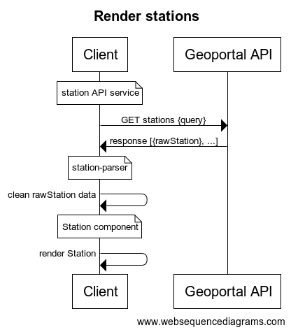
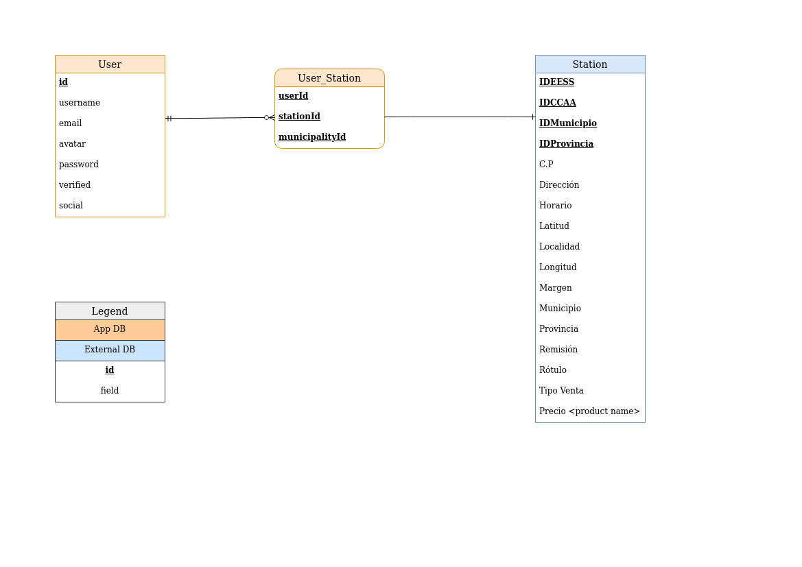

# Documentation

## Goals

Build a strong core of features and extend the codebase as a **progressive web
app** by following these principles:

    - Fullfill MVP requirements to the letter
    - Test core features to ensure stability
    - Modularize code when possible to ease scalability
    - Extend features in a responsible fashion
    

## API Architecture

### stations.service

Each station is an object served by a [public
API](https://geoportalgasolineras.es/#/Descargas).  The way that the station
data is structured is very unwieldy, therefore this service will fulfill two
roles: 

    1. Request an array of stations - `GET /stations`
    2. Parse the raw station objects into useful data - `rawStation => station`

It is not clear at the time of development whether handling this through the
client or by the server would be the best choice (server takes a while to wake
up, and station data is lightweight).

Because of this, it is important that this task is handled as a microservice,
which will accept a `query` object and will return an array of `stations`. This
way we can avoid having a monolithic codebase and therefore it will be possible
to change application responsibilities in the future should we find a better
solution

### Models

#### Users

For the MVP users will authenticate with a password which will be hashed before
storing in the DB. Password lenght will be settable through env variables to 
make development easier.

Alternative authentication features like authenticating with social media 
accounts and email verification will also be considered after core 
functionallity is achieved. 

#### Gas Stations

Station data is held in the [public API
](https://geoportalgasolineras.es/#/Descargas) and therefore can be directly
handled in the client through the [stations.service](#stations.service) 

#### User_Station

The list of Stations favorited by an User will be stored as a pivot table,
which will hold the IDs of the User, Station and the Municipality that the
Station is located in (the latter is used to improve query speed). 

Although non-relational DBs like Mongo allow storing arrays as document
properties, this is an antipattern, and since Stations are stored on a
different DB this was deemed the best option.

### Controllers

For the MVP these will be limited to CRUD operations for Users. All other 
tasks will be handled by the client.
